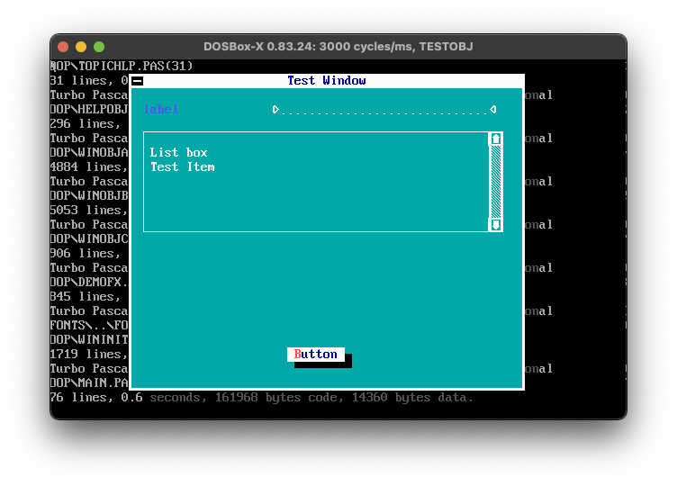

Originally forked from https://github.com/sdancer75/DOS-GUI-Norton-Style/tree/master

This is a framework for showing code-swapping graphical TextUI very similar to that provided by nortonl.lib/stddos.h (see norton utilities 2006 [.7z](https://archive.org/download/SourceCodeCollection/Norton_Utilities_2006_SC.7z)).

## To build

I recommend using DOSBox because it's way easier to edit files shared with DOSBox rather than an MSDOS instance running in VirtualBox.

1. install [turbo assembler](https://github.com/qb40/tasm/) at `\TASM` (drive at your choice)
2. install [turbo pascal](https://archive.org/details/turbopascal7.0) at `\TP`
3. chdir to the source root where [build.bat](build.bat) is located
4. run `build.bat`

## Todo

1. no mouse; WHY?

1. symantec fonts (cpav,norton,norton7.syb) only defines the left/right half of many glyphs, probably due to symmetry; and they are not compatible with this framework

1. the code in oop/*.pas is specifically designed to work with ELINGR.SYB; will have to either fix symantec fonts to work with the code, or have more elaborate skin definitions 

1. background color `WinTextBackGround` greater than 7 is not allowed, unlike NORTONL.LIB which uses bright blue (9) as default background; using anything >7 results in flashing foreground text.

1. many unused unit files needs to be cleaned up

1. better OOP, fewer global variables, indentation and style fix
